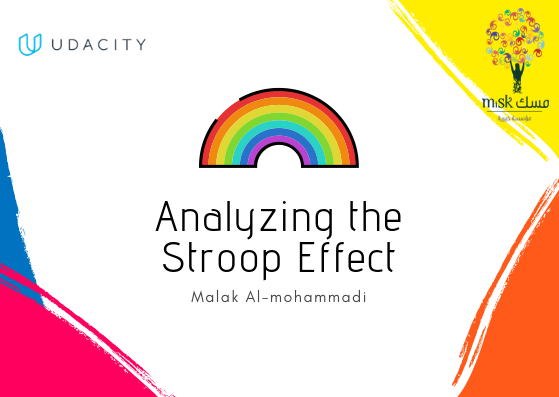

  

# Analyze the Stroop Effect.
## What is Stroop Effect

The Stroop effect is a phenomenon that occurs when you must say the color of a word but not the name of the word. For example, blue might be printed in red and you must say the color rather than the word. For more details, Visit [Wikipedia](https://en.wikipedia.org/wiki/Stroop_effect)

## Background Information
In this Stroop task, participants are presented with a list of words, with each word displayed in a color of ink. The participant’s task is to say out loud the color of the ink in which the word is printed. The task has two conditions: a congruent words condition, and an incongruent words condition. In the congruent words condition, the words being displayed are color words whose names match the colors in which they are printed: for example RED, BLUE. In the incongruent words condition, the words displayed are color words whose names do not match the colors in which they are printed: for example PURPLE, ORANGE. In each case, we measure the time it takes to name the ink colors in equally-sized lists. Each participant will go through and record a time from each condition.

Testing my Statistical abilities, In this project, I have investigated the Stroop Effect by collecting data from others who have performed the same task and computed some statistics describing the results. Finally, I have interpreted the results in terms of my hypothesis.

You can try out Stroop task for yourself [here](https://faculty.washington.edu/chudler/java/ready.html)

### File Descriptions
    ./stroopdata.csv is the dataset
    ./Test a Perceptual Phenomenon.ipynb.ipynb is a Jupyter notebook containing the work I have done
    ./Test a Perceptual Phenomenon.ipynb.html is an HTML Page exported version

### What I learned:
* How to identify components of an experiment.
* How to use descriptive statistics to describe qualities of a sample.
* How to set up a hypothesis test, make inferences from a sample, and draw conclusions based on the results.

#### The Header designed using  [Canva](http://https://www.canva.com) 
